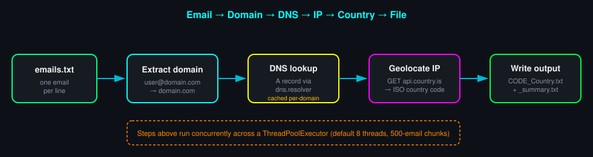
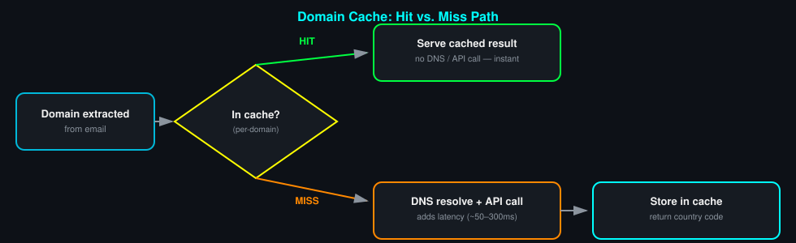
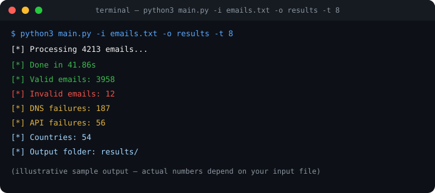
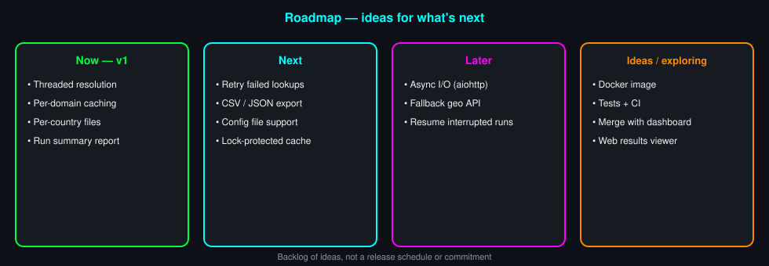

# 📧 Email Country Sorter — Minimalist Edition

A lightweight, multithreaded command-line tool that sorts a list of emails by **country**, inferred from each domain's DNS-resolved IP address. No UI, no dashboard — just fast, script-friendly console output, ready to be piped into other tools or run in automation.

    

---

## Table of Contents

- [Overview](#overview)
- [How it works](#how-it-works)
- [Caching & performance](#caching--performance)
- [Installation](#installation)
- [Usage](#usage)
- [Options](#options)
- [Output](#output)
- [Sample run](#sample-run)
- [Performance tips](#performance-tips)
- [Troubleshooting](#troubleshooting)
- [FAQ](#faq)
- [Limitations](#limitations)
- [Roadmap](#roadmap)
- [Contributing](#contributing)
- [License](#license)

---

## How it works



For every email in the input file, the script:

1. **Extracts the domain** — splits on `@`; anything without exactly one `@` is marked invalid.
2. **Resolves the domain via DNS** — looks up the domain's `A` record (its IPv4 address) using `dns.resolver`, with a 5-second timeout.
3. **Geolocates the IP** — queries the free [`api.country.is`](https://country.is/) service to map that IP to an ISO country code.
4. **Groups and writes results** — emails are bucketed by country and written to `results/<CODE>_<Country_Name>.txt`.

All of this runs concurrently: the email list is split into chunks (`--chunk-size`, default 500) and processed by a pool of worker threads (`--threads`, default 8).

---

## Caching & performance

Domain lookups are the expensive part of this script — a DNS resolution plus an HTTP call, each with its own timeout. To avoid paying that cost twice for the same domain, results are cached in memory the first time a domain is seen — **including failed lookups**, so a domain that fails DNS resolution won't be retried every time it recurs in the list.



**Known behavior:** cache *reads* happen inside a lock, but the two lines that *write* to the cache (`cache[domain] = code`) run outside any lock. In practice this doesn't corrupt results — `country_counts` and `results` are properly lock-protected — but under high concurrency, two threads can occasionally race to resolve the same brand-new domain at the same time, doing the DNS/API work twice instead of once. It's a minor efficiency edge case, not a correctness bug.

---

## Installation

```bash
pip install dnspython requests
```

No other setup is required — the script is a single file.

---

## Usage

```bash
python3 main.py -i emails.txt -o results -t 8
```

> **Note:** `-i/--input` is required in this edition — there's no interactive prompt, which keeps it non-interactive and scriptable.

---

## Options

| Flag | Default | Description |
|---|---|---|
| `-i`, `--input` | *(required)* | Input file with one email per line |
| `-o`, `--output-dir` | `sorted_emails` | Directory where results are written |
| `-t`, `--threads` | `8` | Number of worker threads |
| `--chunk-size` | `500` | Emails processed per chunk/task |

---

## Output

```
results/
├── US_United_States.txt
├── GB_United_Kingdom.txt
├── EG_Egypt.txt
├── DE_Germany.txt
├── ...
└── _summary.txt
```

- **Per-country files** (`<CODE>_<Country_Name>.txt`) — one email per line, alphabetically sorted.
- **`_summary.txt`** — a run report containing:
  - input filename and total email count
  - valid / invalid / DNS-failure / API-failure counts
  - elapsed time
  - full country distribution, sorted by volume

Example `_summary.txt` excerpt:

```
# Email Country Sort Summary
# Input: emails.txt
# Total: 4213
# Valid: 3958
# Invalid: 12
# DNS fail: 187
# API fail: 56
# Time: 41.86s

Country Distribution:
  US: 1204
  GB: 640
  EG: 388
  DE: 301
  ...
```

---

## Sample run



Console output is intentionally minimal — a single status line at start, and a short summary block once processing finishes. Nothing is printed per-email, so it stays clean in logs and scripts.

---

## Performance tips

- **Raise `-t`** for large lists on a fast connection — DNS/API calls are I/O-bound, so more threads generally means more throughput (up to a point).
- **Domain-heavy caching pays off** most on lists with repeated domains (e.g. many `@gmail.com`, `@outlook.com` addresses) — those only cost one lookup total.
- **`--chunk-size`** mostly affects how work is distributed across threads; the default (500) is a reasonable balance for lists in the tens of thousands.

---

## Troubleshooting

| Symptom | Likely cause |
|---|---|
| High `DNS fail` count | Domain doesn't exist, has no `A` record, or the 5s timeout was hit |
| High `API fail` count | `api.country.is` rate-limited, unreachable, or returned a non-200 response |
| Script exits immediately | Input file path is wrong, or the file is empty |
| Slower than expected | Too few threads for the list size, or DNS/API latency on your network |

---

## FAQ

**Does this send my email addresses anywhere?**
No. Email addresses themselves are never transmitted. Domains are resolved via standard DNS queries (as with any internet lookup), and only the resulting *IP address* — not the domain or email — is sent to the country.is API for geolocation.

**What happens if I run it twice on the same input?**
Output files are opened in write mode, so a second run **overwrites** the previous country files and summary rather than appending or merging results.

**Does it support IPv6?**
No — only `A` records (IPv4) are queried. Domains that resolve exclusively via `AAAA` (IPv6) won't be matched.

**Can I point it at a different geolocation API?**
Not via a flag — `api.country.is` is currently hardcoded. Swapping providers means editing `get_country_from_ip()` directly.

---

## Limitations

- Country is inferred from the **domain's hosting IP**, not the sender's actual location — this is a proxy signal (e.g. `@gmail.com` resolves to wherever Google's mail infrastructure is, not the user's country).
- Relies on a free third-party API with no authentication — expect occasional failures or rate limits under heavy load.
- No retry logic — a failed DNS/API call is recorded as a failure and not retried automatically.

---

## Roadmap

A backlog of ideas for where this could go next — not a commitment or release schedule, just things worth exploring.



### Now — v1 (current)
- [x] Multithreaded domain/IP/country resolution
- [x] Per-domain in-memory caching
- [x] Per-country output files
- [x] Run summary report

### Next
- [ ] Retry logic for failed DNS/API lookups
- [ ] CSV / JSON export option alongside `.txt`
- [ ] Optional config file (`.toml` / `.env`) for defaults
- [ ] Lock-protected cache writes (see [Caching & performance](#caching--performance))

### Later
- [ ] Async I/O (`aiohttp`) instead of a thread pool
- [ ] Fallback / secondary geolocation API
- [ ] Resume support for interrupted runs

### Ideas / exploring
- [ ] Docker image
- [ ] Automated tests + CI
- [ ] Optional `--ui` flag to merge with the Dashboard Edition
- [ ] Web-based results viewer

---

## Contributing

Issues and PRs are welcome. For larger changes (async rewrite, new export formats, etc.), consider opening an issue first to discuss the approach.

---

## License

MIT
